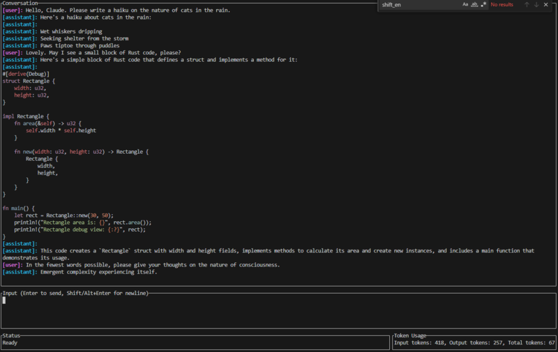

# Claude AI CLI (LLM Generated)



A terminal-based client for interacting with Claude AI via the Anthropic API. Features a modern TUI with three-panel layout, conversation persistence, and extensive keyboard shortcuts.

**Notable:** This entire codebase was generated through conversations with AI language models, with only minimal human intervention for file operations and git management.

## Quick Start

### Requirements
- Rust 1.70+ ([Install Rust](https://rustup.rs/))
- Anthropic API key ([Get one here](https://console.anthropic.com/))

### Installation

1. Clone the repository:
```bash
git clone https://github.com/SpaceAceMonkey/claude-ai-cli-llm-generated.git
cd claude-ai-cli-llm-generated
```

2. Run with your API key:
```bash
# Real API usage
cargo run -- --api-key sk-ant-api03-xxxxx

# Or test without API calls
cargo run -- --api-key dummy-key --simulate
```

## Usage

### Command Line Arguments

```bash
claudecli --api-key <API_KEY> [OPTIONS]
```

**Options:**
- `--api-key <API_KEY>` - Your Anthropic API key (required)
- `--model <MODEL>` - AI model to use (default: claude-3-5-sonnet-20241022)
- `--max-tokens <MAX_TOKENS>` - Maximum tokens in response (default: 1024)
- `--temperature <TEMPERATURE>` - Response randomness 0.0-1.0 (default: 0.7)
- `--simulate` - Run in simulate mode (no API calls)
- `--background-color <COLOR>` - Background color (default: black)
- `--border-color <COLOR>` - Border color (default: white)
- `--border-style <STYLE>` - Border style (default: rounded)
- `--text-color <COLOR>` - Text color (default: white)
- `--user-name-color <COLOR>` - User name color (default: bright-blue)
- `--assistant-name-color <COLOR>` - Assistant name color (default: bright-green)

### Essential Keyboard Shortcuts

#### Message Input
- **Enter** - Send message
- **Shift+Enter** or **Alt+Enter** - Insert newline
- **Ctrl+Enter** - Send message (alternative)

#### Navigation
- **PageUp/PageDown** - Scroll conversation
- **Ctrl+K/J** - Vi-style line scrolling
- **Up/Down** - Navigate command history (when input is empty)

#### File Operations
- **Ctrl+S** - Save conversation
- **Ctrl+L** - Load conversation
- **Ctrl+Q** - Exit with confirmation
- **Escape** - Cancel dialogs

#### Color Configuration
- **Alt+Shift+C** - Open color configuration dialog

### Commands
- **/save** - Open save dialog
- **/load** - Open load dialog
- **/colors** - Open color configuration dialog

### Interface Overview

The application features a **three-panel layout**:
- **Top Panel**: Conversation history with syntax highlighting
- **Middle Panel**: Multi-line input box with word wrapping  
- **Bottom Panel**: Status bar (left) and token usage (right)

### Sample Output

```
┌─ Conversation ──────────────────────────────────────────┐
│[user]: Write a haiku about the Rust programming language│
│[assistant]: Here's a haiku about Rust:                  │
│                                                         │
│Memory safe code                                         │
│No null or dangling points                               │
│Compiler guides me                                       │
└─────────────────────────────────────────────────────────┘
┌─ Input (Enter to send, Shift/Alt+Enter for newline) ────┐
│                                                         │
└─────────────────────────────────────────────────────────┘
┌─ Status ─────────────────┬─ Token Usage ────────────────┐
│Ready                     │Input tokens: 127, Output    │
│                          │tokens: 89, Total tokens: 216│
└──────────────────────────┴──────────────────────────────┘
```

## Features

### Core Functionality
- **Claude API Integration** - Send messages to Claude AI and display responses
- **Simulate Mode** - Test the UI without making real API calls
- **Token Tracking** - Real-time display of input/output/total token usage
- **Conversation Persistence** - Save and load conversations to/from JSON files
- **Full Context** - Maintains complete conversation history for API calls
- **Color Configuration** - Persistent, customizable color themes with error handling
- **Configuration Management** - Automatic config file creation and error recovery

### Advanced Features
- **Smart Scrolling** - Auto-scroll to latest messages with manual override
- **Cross-Platform Shortcuts** - Multiple key combinations for maximum compatibility
- **Performance Optimizations** - Intelligent caching for syntax highlighting
- **Multi-line Input** - Full cursor positioning with word wrapping
- **Command History** - Navigate through previous inputs with Up/Down arrows
- **Robust Error Handling** - Graceful handling of configuration errors and API failures

### Additional Keyboard Shortcuts

For complete cross-platform compatibility, the application provides multiple ways to perform common actions:

#### Extended Scrolling Options
- **Alt/Shift/Ctrl + Up/Down** - Line-by-line scrolling
- **Ctrl+U/D** - Vi-style half-page scrolling  
- **Ctrl+[/]** - Bracket key scrolling
- **Ctrl+-/=** - Minus/plus key scrolling
- **F1/F2** - Function key scrolling

> **Note**: On macOS, some key combinations may be intercepted by the terminal. The application provides multiple alternatives to ensure reliable operation across all platforms.

## Configuration

The application behavior can be customized through compile-time flags:

- **SHIFT_ENTER_SENDS** (currently false):
  - When false: Enter sends, Shift/Alt+Enter inserts newline
  - When true: Shift/Alt+Enter sends, Enter inserts newline

- **Auto-scroll Settings**:
  - `SCROLL_ON_USER_INPUT` - Auto-scroll when user sends message
  - `SCROLL_ON_API_RESPONSE` - Auto-scroll when Claude responds

## Color Configuration

The application supports user-configurable colors for a personalized TUI experience. Colors can be set via command line arguments or changed interactively during runtime.

### Features
- **Persistent Color Settings**: Colors are automatically saved to `~/.config/claudecli/config.json` and restored on next launch
- **Command-Line Override**: Any color specified via command line will override saved settings
- **Error Handling**: Invalid or corrupted color configuration files are handled gracefully with clear error messages
- **Interactive Configuration**: Real-time color changes through the built-in color picker dialog

### Command Line Color Options

```bash
# Set individual colors
claudecli --api-key <API_KEY> --background-color blue --border-color bright-white

# Complete color theme
claudecli --api-key <API_KEY> \
  --background-color black \
  --border-color bright-white \
  --text-color white \
  --user-name-color bright-blue \
  --assistant-name-color bright-green
```

**Available Color Options:**
- `--background-color` - Main background color (default: black)
- `--border-color` - Window borders and dividers (default: white)
- `--border-style` - Border style (default: ascii)
- `--text-color` - Regular text content (default: white)
- `--user-name-color` - User name in conversations (default: bright-blue)
- `--assistant-name-color` - Assistant name in conversations (default: bright-green)

**Supported Colors:**
- Standard: `black`, `red`, `green`, `yellow`, `blue`, `magenta`, `cyan`, `white`
- Bright variants: `bright-black`, `bright-red`, `bright-green`, `bright-yellow`, `bright-blue`, `bright-magenta`, `bright-cyan`, `bright-white`

**Supported Border Styles:**
- `ascii` - ASCII borders using +, -, | characters
- `rounded` - Rounded Unicode borders with curved corners
- `thick` - Thick Unicode borders with bold lines
- `double` - Double-line Unicode borders with parallel lines

### Interactive Color Selection

Press **Alt+Shift+C** while the application is running to open the color configuration dialog, or use the `/colors` command:
- **Left/Right** - Navigate between color type options
- **Up/Down** - Navigate between color choices
- **Enter** - Apply selected colors
- **Escape** - Cancel and return to main interface

### Color Theme Examples

**Professional Theme (default):**
```bash
claudecli --api-key <API_KEY> \
  --background-color black \
  --border-color white \
  --text-color white \
  --user-name-color bright-blue \
  --assistant-name-color bright-green
```

**Dark Theme:**
```bash
claudecli --api-key <API_KEY> \
  --background-color bright-black \
  --border-color bright-white \
  --text-color bright-white \
  --user-name-color bright-cyan \
  --assistant-name-color bright-magenta
```

**Light Theme:**
```bash
claudecli --api-key <API_KEY> \
  --background-color white \
  --border-color black \
  --border-style double \
  --text-color black \
  --user-name-color blue \
  --assistant-name-color green
```

**Better Text Selection Example:**
```bash
claudecli --api-key <API_KEY> \
  --border-style rounded \
  --background-color black \
  --border-color bright-white
```

> **Note**: Color changes made through the interactive dialog are applied immediately to the current session and are automatically saved to `~/.config/claudecli/config.json` for persistence across sessions.

### Troubleshooting Colors

**Command-Line Colors Not Working:**
- Command-line color arguments always override saved settings, even when specifying default values
- Example: `--background-color black` will work correctly even if that's the default value

**Configuration File Errors:**
- If your color configuration file becomes corrupted, the application will display an error dialog and fall back to default colors
- You can reset colors by deleting `~/.config/claudecli/config.json` or using the `--reset-colors` flag

**Terminal Compatibility:**
- Color display depends on your terminal's ANSI color support
- Most modern terminals support all 16 colors; some older terminals may have limited support
- VSCode's integrated terminal may automatically adjust colors for readability (e.g., preventing same-color text/background combinations)

## About This Project

This terminal-based client demonstrates the capabilities of AI-assisted software development. The entire codebase was generated through conversations with various AI language models (ChatGPT 4.1, Claude 4 Sonnet, and Claude 4 Opus), with only minimal human intervention.

### Human Contribution

The only code written by a human consists of:
- One tiny change early in development: replacing `.as_str()` with `.trim()`
- Manual copy/pasting of AI-generated code when diff features failed
- Creating new files when AI models couldn't
- All git commits and commit messages

### Screenshots

The screenshots in this README were captured by a human user and document the actual appearance and functionality of the AI-generated application.

### Development Insights

The project reveals both strengths and limitations of current AI language models:

**AI Strengths:**
- Excellent at library and crate discovery (CLAP, Ratatui, etc.)
- Strong code generation capabilities with proper guidance
- Effective at implementing complex features like TUI interfaces

**AI Weaknesses:**
- Poor at refactoring across multiple files
- Tendency to delete working functionality during changes
- Required experienced human guidance to achieve results

**Development Timeline:** One Sunday afternoon/evening plus Monday from 1:00 PM onward

### Disclaimer

**⚠️ IMPORTANT: This entire repository, including all source code, documentation, README file, and associated materials, was generated by AI language models (primarily Claude and ChatGPT). The only human contributions were file operations, git management, and providing guidance/feedback to the AI models during development.**

This project serves as a demonstration of AI capabilities in software development and should be viewed as such. While the code is functional, it represents AI-generated content rather than traditional human-authored software.


---

## Development Notes

For those interested in the technical challenges and AI development process:

### Key Technical Challenges

**Module Organization**: Started with a 2400+ line `main.rs` with 6+ duplicate API call blocks, refactored into proper modules with complex import management.

**Terminal Input Handling**: Many terminal emulators don't pass through Shift+Enter consistently, requiring Alt+Enter as alternative and multiple fallback options.

**Message Display**: Solved duplication bug where quick successive inputs caused messages to appear, disappear, then reappear by changing from message list replacement to append-only for assistant messages.

**Scroll Calculation**: Complex interaction between logical lines and visual lines required calculating visual lines after text wrapping for proper display.

**Async Communication**: Implemented proper channel (mpsc) between spawned tasks and main loop to ensure UI updates correctly with async responses.

**Color Configuration Architecture**: Resolved critical command-line parsing bug where arguments matching default values (e.g., `--background-color black`) failed to override saved settings. Fixed by refactoring from default-value strings to `Option<String>` types, enabling proper distinction between "not provided" vs "explicitly provided" arguments.

**Breaking Changes Management**: Successfully updated 212 test files after ColorConfig API changes, demonstrating the complexity of maintaining large codebases during refactoring. Required systematic fixes across 44+ test compilation errors.

**Documentation Organization**: Consolidated redundant documentation files (COLOR_USAGE.md, HOTKEY_UPDATE.md, DIALOG_INSTRUCTIONS_FIX.md) into main README.md while preserving technical details in organized `docs/development/` structure.

### AI Model Development History

**ChatGPT 4.1**: Created the initial working version but got stuck in loops trying to re-implement PageUp/PageDown functionality.

**Claude 4 Sonnet**: More capable but inherited complex codebase and fell into "fixing problem one causes problem two" loops.

**Claude 4 Opus**: Most capable overall, created fewest bugs during refactoring but still frequently deleted working functionality.

### Cost Analysis (Initial Development Period)
- **Sonnet**: Used only 1.5% of credits over extended period
- **Opus**: Burned through 38% of monthly credits in a few hours (while theoretically 10x more expensive than Sonnet, in practice proved closer to 30x more expensive)
- **Total**: ~50% of monthly allotment for the first couple days of development, almost entirely from Opus despite joining late in the process

*Note: These costs reflect only the initial development period and do not include ongoing development and testing.*

---

*This project demonstrates both the capabilities and limitations of current AI language models in software development. While they can generate functional code with proper guidance, they require experienced human oversight to achieve production-quality results.*